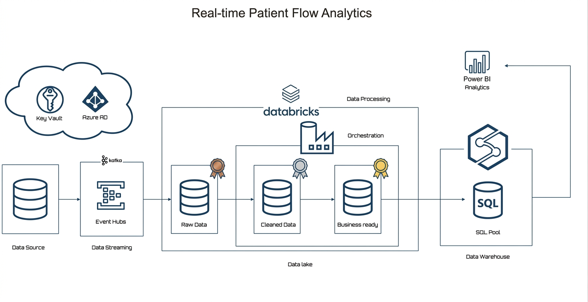

# Real-Time Patient Flow Analytics on Azure




## Overview

This project implements a real-time healthcare data pipeline on Azure for analyzing patient flow across hospital departments.

The solution ingests streaming patient events through Azure Event Hub, processes and transforms data using Databricks (PySpark), stores curated datasets in Azure Data Lake Storage, and loads analytical models into Azure Synapse Analytics.

---

## Architecture

<p align="center">
  
</p>

---
## Objectives

* Build a real-time streaming pipeline on Azure.
* Ingest patient flow events using Azure Event Hub.
* Process and transform data with Databricks and PySpark.
* Implement Bronze, Silver, and Gold data layers.
* Design a star schema in Azure Synapse Analytics.
* Enable scalable analytics on patient flow data.

---

## Technology Stack

* Azure Event Hub
* Azure Databricks
* PySpark
* Azure Data Lake Storage Gen2
* Azure Synapse Analytics
* Python
* Git

---

## Project Structure

```text
real-time-patient-flow-azure/
│
├── databricks-notebooks/
│   ├── 01_bronze_rawdata.py
│   ├── 02_silver_cleandata.py
│   └── 03_gold_transform.py
│
├── simulator/
│   └── patient_flow_generator.py
│
├── sqlpool-queries/
│   └── SQL_pool_queries.sql
│
└── README.md
```
---

## Data Pipeline

### 1. Data Ingestion

Patient flow events are generated and streamed into Azure Event Hub using a Python simulator.

Example event attributes:

* Patient ID
* Department
* Admission Time
* Wait Time
* Discharge Status

### 2. Bronze Layer

* Raw JSON events are ingested from Event Hub.
* Data is stored in Azure Data Lake Storage without modification.
* Serves as the source of truth.

### 3. Silver Layer

* Data quality validation.
* Schema enforcement.
* Data cleansing and standardization.
* Null handling and type conversions.

### 4. Gold Layer

* Business-ready datasets.
* Aggregations and transformations.
* Fact and dimension table generation.

### 5. Synapse Analytics

Curated Gold Layer data is loaded into Azure Synapse Analytics for analytical querying and reporting.

---

## Star Schema

### Fact Table

* FactPatientFlow

### Dimension Tables

* DimPatient
* DimDepartment


---

## Key Features

* Real-time event ingestion
* Streaming ETL with Databricks
* Medallion Architecture (Bronze → Silver → Gold)
* Star Schema Data Warehouse Design
* Scalable Azure-native solution
* Healthcare patient flow analytics

---

## Outcomes

* End-to-end real-time data pipeline.
* Cloud-native data engineering architecture.
* Optimized analytical model in Synapse.
* Reusable framework for healthcare streaming use cases.
